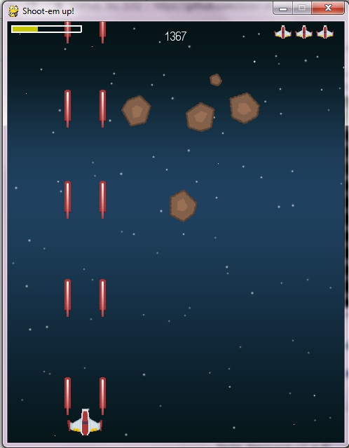

# Shoot them up!

This repository contains code for "Shoot them up!" game.

Resources for pygame:
1. KidsCanCode Youtube channel (https://www.youtube.com/playlist?list=PLsk-HSGFjnaH5yghzu7PcOzm9NhsW0Urw)

For image credits, read [this](img/README.md).
For sound credits, read [this](sound/README.md).